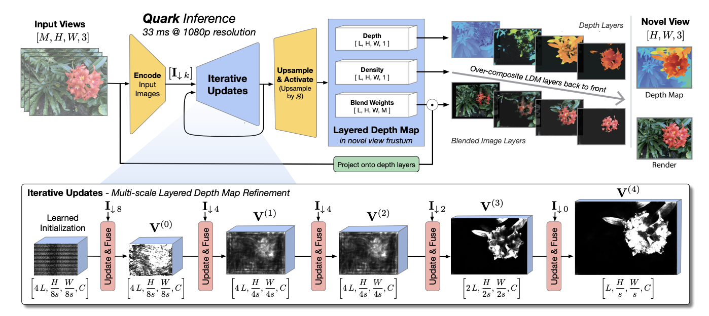

## Quark: Real-time, High-resolution, and General Neural View Synthesis

This is an on-going unofficial pytorch implementation of the following paper:

Flynn, John, et al. "[Quark: Real-time, High-resolution, and General Neural View Synthesis.](https://arxiv.org/pdf/2411.16680v1)" ACM Transactions on Graphics (TOG) 43.6 (2024): 1-20.

    

## Roadmap

| Status | Milestone                                                                                             |    ETA     |
| :----: | :---------------------------------------------------------------------------------------------------- | :--------: |
| 🚀 | **Implement all modules that have learnable parameters** | 2024-12-31 |
| 🚀 | **Implement the train code**              | TBD |
| 🚀 | **Implement the inference code**              | TBD |

## Note

Although I am supposed to implement alone, please let me know if you want to involve in! We may significantly speed the implementation up.

For now this is just for fun and I plan to spend some of my free time, so please also let me know if you want the implementations to be done soon.